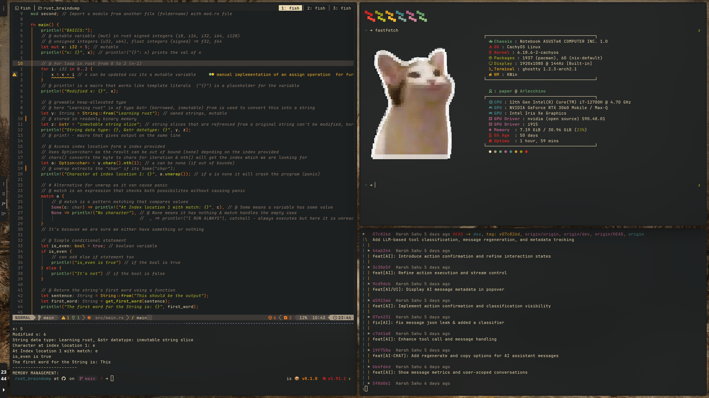
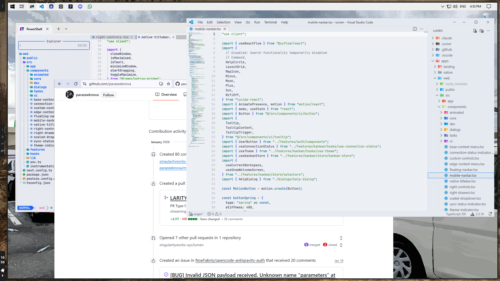

  
   
  <h3>a place to "stow" my dotfiles hence "doty" ~ tada</h3>

###### *
// KDE Gruvbox Rice
*
  

   

###### *
// Windholes 10 VM
*
  

### What the hek is this ?
Contains various dotfiles and configurations for setting up a development environment quickly for web + rust.

### Would it work on my system ?
I use Arch btw, but it should work on most Linux distributions with the necessary packages installed, i'll try to keep it as distro-agnostic as possible but few may not work like package managers and such.

### How to use ?
Just clone the repo in your home directory & use stow to symlink the files to their respective locations.

### Ahh, I'll leave this here then
- [dotfiles](https://github.com/parazeeknova/dotfiles) - My old dotfiles for i3wm, minimal and lightweight
- [hypr](https://github.com/parazeeknova/hypr) - Little module for modeset & powerprofile for waybar
- [pistachio-v1](https://github.com/parazeeknova/pistachio-dotfiles) - Openbox dotfiles, uploaded on r/unixporn
- [pistachio-v2](https://github.com/parazeeknova/pistachio-V2-dotfiles) - Better pista dotfiles, uploaded on r/unixporn
- [bitwise-blur](https://github.com/parazeeknova/bitwise-blur-waves-dotfiles) - My first dotfiles, uses everforest colorscheme + green ocean