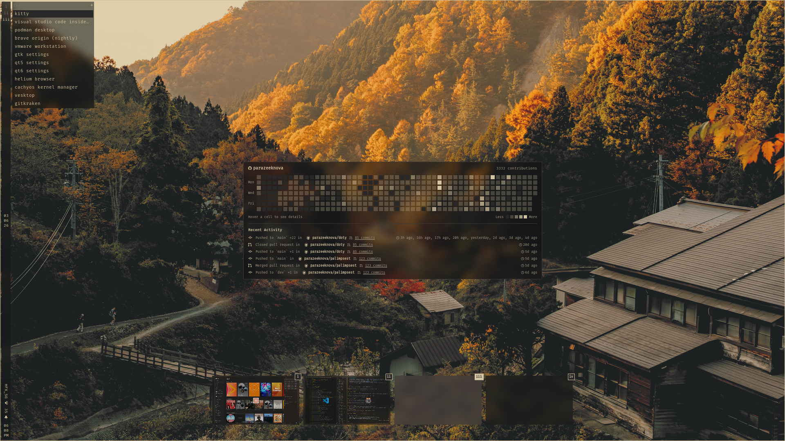
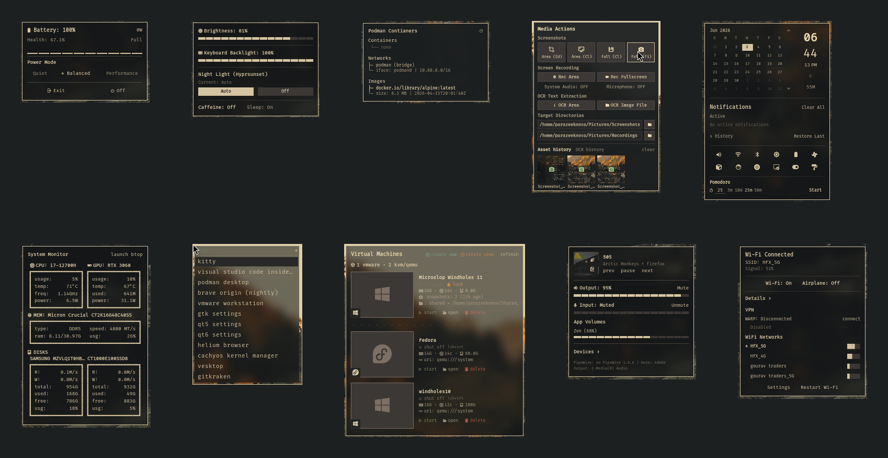

  <h2>wabi</h2>
  <h3>stowed in ~, worn with time</h3>
   
  

### doty
dotfiles, quickshell widgets, rust daemons, and configs for my daily setup.  
stow-based. arch-first but mostly distro-agnostic.

#### what's inside

- **quickshell** - widgets (dashboard, popups, bla bla)
- **rust daemons** - background services wired to the widgets  
- **configs** - shell, editor, wm, and misc dotfiles

###### *
Gruvbox Rice
*
  

   

###### *
Quickshell Utilities
*
  

### What the hek is this ?
personal dotfiles. quickshell widgets, rust daemons, and configs i use daily.
nothing novel, just the way i like things..

### Would it work on my system ?
I use it daily on cachyos (i use arch btw). should work on any systemd-based distro with the right packages. package manager integrations are arch-only, everything else  
is portable.

### How to use ?
Just clone the repo in your home directory & use stow to symlink the files to their respective locations, then pray.

## notes
- some modules have hard dependencies, check the relevant config before enabling
- no install script, no hand-holding, stow and sort it yourself
- issues and PRs welcome if something's broken or you have suggestions